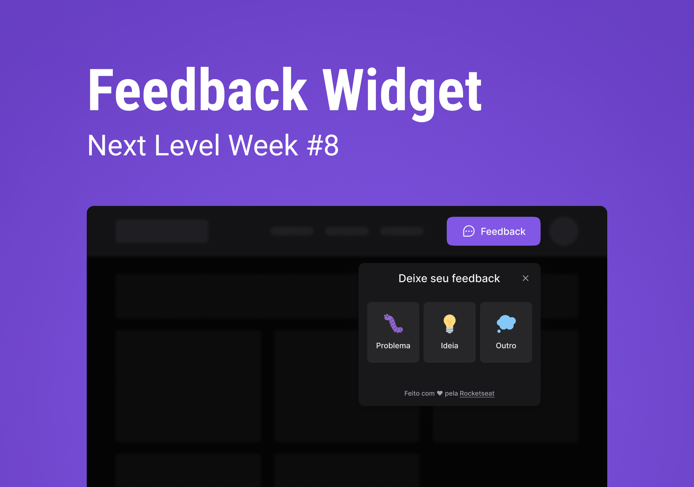

<h1 align="center">Next Level Week - Impulse Return</h1>

## :page_facing_up: Sobre  /  About 

:brazil: Next Level Week Return (8° Edição) do evento gratuito da Rocketseat oferecido para a comunidade dev. Nesta edição, na trilha Impulse, foi desenvolvido um widget completo e acessível que pode ser usado em vários projetos para coletar feedback dos usuários.

O meu projeto possui algumas alterações em relação a tecnologias que foram mostradas no evento, mas ainda assim mantendo a ideia/funcionalidade principal do projeto.

No Evento foram usadas tecnologias do ecosistema Javascript no **BACKEND** foram usados [Express](https://expressjs.com/), [TypeScript](https://www.typescriptlang.org/), [Prisma](https://www.prisma.io/),[Jest](https://jestjs.io/) no **FRONTEND(não incluso no meu projeto)** [React](https://reactjs.org/), [Tailwind CSS](https://tailwindcss.com/) e no **MOBILE** [React Native](https://reactnative.dev/), [Expo](https://expo.dev/).

No meu projeto foi todo construído utilizando a linguagem de programação [Kotlin](https://kotlinlang.org/), onde o aplicativo Android nativo, consome a API backend enviado um feedback.

:us: Next Level Week Return (8th Edition) of Rocketseat's free event offered to the dev community. In this edition, a complete and accessible widget has been developed to be used in multiple projects, in the Impulse track, a complete and accessible widget has been developed to be used in several projects, so you can see user feedback.

My project has some changes in relation to the project that were changed at the event, but it still assimilates the main idea/functionality of the project.

In the Event, unused Javascript ecosystem technologies were used **BACKEND** were [Express](https://expressjs.com/), [TypeScript](https://www.typescriptlang.org/), [Prisma]( https://www.prisma.io/),[Jest](https://jestjs.io/) on **FRONTEND(not included in my project)** [React](https:// reactjs.org/ ), [Tailwind CSS](https://tailwindcss.com/) and on **MOBILE** [React Native](https://reactnative.dev/), [Expo](https:// expo.dev/ ).

In mine it was all built using a project language [Kotlin](https://kotlinlang.org/), where the native Android app consumes a back-end API sent a feedback.

## :computer:  Tecnologias / Technologies

- :iphone: [Mobile](https://github.com/Henrique-Santos-da-Silva/nlw-return-impulse-kotlin/tree/main/mobile/FeedbackApp)
  - [Kotlin](https://kotlinlang.org/)
  - [MVP (Model View Presenter) Architecture Android](https://www.geeksforgeeks.org/mvp-model-view-presenter-architecture-pattern-in-android-with-example/)
  - [Navigation Component](https://developer.android.com/topic/libraries/architecture/navigation)
  - [Koin](https://insert-koin.io/)
  - [Coroutines](https://kotlinlang.org/docs/coroutines-overview.html)

- :globe_with_meridians: [Backend](https://github.com/Henrique-Santos-da-Silva/nlw-return-impulse-kotlin/tree/main/server/nlw-impulse-return)

  - [Ktor](https://ktor.io/)
  - [JetBrains/Exposed](https://github.com/JetBrains/Exposed)
  - [Jakarta Mail](https://jakarta.ee/specifications/mail/2.0/jakarta-mail-spec-2.0.html)
  - [Postgres for deployment](https://www.postgresql.org/)
  - [Sqlite for development](https://www.sqlite.org/index.html)

  

  ## :clipboard: Licença / License

  :brazil: Esse projeto está sob a licença MIT. Veja o arquivo [LICENÇA](LICENSE) para mais detalhes.

  :us: This project is under the MIT license. See the [LICENSE](LICENSE) file for more details.

  

  ​	

